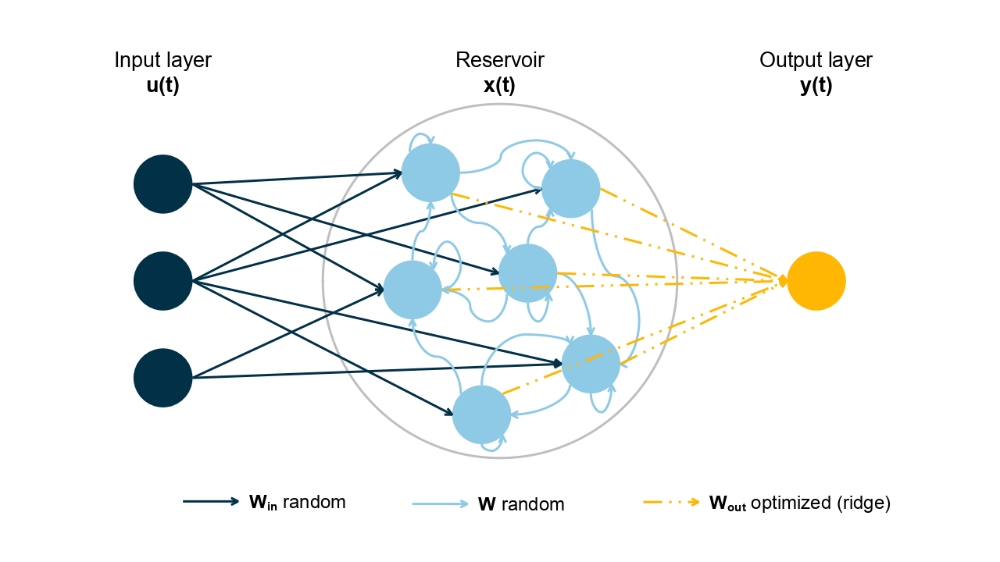

```{r, setup, include=FALSE}
options(prompt = 'R> ', continue = '+ ')
set.seed(1)
```

# Introduction

Reservoir Computing (RC) is a prominent machine learning methodology, proposed by @kim_health_2020 and @maass_real-time_2002,
that has gained significant attention in recent years for its ability to
effectively process information generated by dynamical systems. This
innovative approach leverages the dynamics of a high-dimensional
reservoir to perform complex computations and solve various tasks based
on the response of this dynamical system to input signals. RC has demonstrated its efficacy in tackling various challenges, encompassing pattern classification and time series forecasting in applications ranging from electrocardiogram analysis to bird calls, power plants, internet traffic, stock prices, and beyond [@tanaka_recent_2019].

RC is a kind of recurrent neural networks (RNNs) where the internal states, denoted as the reservoir, is randomly generated and solely the final layer is trained. The reservoir projects temporal input signals onto a high-dimensional feature space facilitating the learning of non-linear and temporal interactions. This offers the advantage of decreasing the computing time while consistently maintaining robust performance compared to conventional RNNs [@shahi_prediction_2022, @vlachas_backpropagation_2020].

The utilization of RC poses challenges on multiple fronts. Firstly, its stochastic nature, attributed to the random aspect of the reservoir, introduces unpredictability into the results, even with well-chosen hyperparameters. Secondly, RC relies on numerous hyperparameters to establish connections between neurons. Guidance on determining these hyperparameters is limited, often requiring users to adopt a wrapper approach where combinations of hyperparameter performance are assessed on a training set before selecting the optimal combination. Thirdly, there is a current absence of implementation in R, rendering the method challenging for users unfamiliar with Python [@trouvain_reservoirpy_2020, @steiner_pyrcn_2022] or Julia [@martinuzzi_reservoircomputingjl_2022].

In this paper, we endeavor to delve into these challenges, offering comprehensive guidance to assist new users in maximizing the benefits of RC. Initially, a broad introduction to reservoir computing is presented, accompanied by a tutorial on its application using `reservoirnet`, an R package built upon the `reservoirPy` Python module [@trouvain_reservoirpy_2020]. Subsequently, we investigate the various challenges associated with the use of RC for forecasting COVID-19 hospitalizations. This exploration includes detailed guidance on the modeling strategy, the selection of hyperparameters, and the implementation process.

# RC presentation

RC is a machine learning algorithm composed of an input layer denoted
$u(t)$ which is randomly transformed by the reservoir into an activation
state denoted $x(t)$ which is fed to a ridge penalized linear regression
trained to forecast the outcome denoted as $y(t)$ as depicted at figure
\@ref(fig:rcpresentation).

```{r rcpresentation, echo=FALSE, fig.cap="my caption", out.width = '90%', fig.cap="Reservoir computing is composed of an input layer, a reservoir and an output layer. Connection between input layer and reservoir and inside reservoir are random. Only the output layer is optimized based on a ridge penalized linear regression."}

```

The input layer $u(t)$ is an $M$-dimension vector, where $M$ is the number of input time series, which corresponds to the values of the input time series at time $t$ where $t = 1, …, T$. The reservoir layer $x(t)$ is an $N_{res}$-dimensional vector where $N_{res}$ is the number of nodes in the reservoir. The value $x(t)$ is defined as follow:

$$x( t+1 ) = ( 1 - \alpha )  x ( t) + \alpha \: tanh( W x(t) + W_{in} u(t+1) ) \text{ , where } \alpha \in [0, 1 ]$$

The leaking rate alpha define the rate of update of the nodes. The
closer $\alpha$ is to $1$, the higher the reservoir is sensitive to new
inputs (i.e $u(t)$). Therefore, the reservoir state at time $t+1$
denoted $x(t+1)$ depends on the reservoir state at the previous time
(i.e $x(t)$) and the new inputs (i.e $u(t+1)$). Both $W_{in}$ and $W$
are random matrices of size $Nres \times M$ and $Nres \times Nres$
respectively.

$W_{in}$ is a dense matrix generated using a Bernoulli distribution
where each value can be either $-I_{scale}(m)$ or $I_{scale}(m)$ with an
equal probability where $m = 1, …, M$ corresponds to a given feature in
the input layer. The input scaling, denoted $I_{scale}$, is an
hyperparameter coefficient which can be common to all features from the
input layer or specific to each feature $m$. In that case, the more
important the feature is, the greater should be its input scaling. $W$
is a sparse matrix where values are generated from a Gaussian
distribution $\mathcal{N}(0,1)$. Then the matrix $W$ is scaled
according to the spectral radius, an hyperparameter defining the highest
eigen value of $W$.

The final layer is a linear regression with ridge penalization where the
explanatory features are the reservoir state and the variable to be
explain is the outcome to predict such that:

$$W_{out} = YX^T ( XX^T + \lambda  I)^{ -1 }$$

Where x(t) and y(t) are accumulated in X and Y respectively such that:

$$X = \begin{bmatrix} x(1) \\ x(2) \\ ... \\ x(T) \end{bmatrix}
\text{ and } Y = \begin{bmatrix} y(1) \\ y(2) \\ ... \\ y(T) \end{bmatrix}$$

The parameter $\lambda$ is the ridge penalization which aims to prevent
overfitting. One can also connect the input layer to the output layer in addition to the reservoir nodes. In that case, $X$ is the accumulation of both such that :

$$X = \begin{bmatrix} x(1), u(1) \\ x(2), u(2) \\ ... \\ x(T), u(T) \end{bmatrix}
\text{ and } Y = \begin{bmatrix} y(1) \\ y(2) \\ ... \\ y(T) \end{bmatrix}$$

Overall, there are four main hyperparameters to be chosen by the user: the leaking rate which defines the memory of the RC, the input scaling which define the relative importance of the features, the spectral radius which define the connections of the neurons inside the reservoir which in turn define the degree of non-linear combination of features and the ridge penalization which controls the degree of overfitting. The choice of hyperparameter often rely on a wrapper approach where the performance of the RC with different combinations of hyperparameters is evaluated on a train set and the best combination is chosen to forecast on the test set.

# Basic package use

In this section, we will cover the basics of reservoirnet use including
installation, classification and regression. We will provide brief
overview of the package use and more in depth description is provided in
section 4 with the covid-19 forecast use case.

## Installation

reservoirnet is an R package api making the python module reservoirPy
easily callable from R. It is available on CRAN (see
<https://cran.r-project.org/package=reservoirnet>) and can be installed
using:

```{r eval=FALSE}
install.packages("reservoirnet")
```

Reservoir Computing (RC) is well suited to both regression and
classification tasks. We will introduce a simple example for both task.

## Regression {#basicregression}

### Covid-19 data

In this first use case, we will introduce the fundamental usage of the `reservoirnet` package. This demonstration will be conducted using the COVID-19 dataset that is included within the package. These data encompass hospitalization, positive RT-PCR results, and overall RT-PCR data sourced from Santé Publique France, which are publicly available on data.gouv.fr (for further details, refer to `help(dfCovid)`). Our primary objective is to predict the number of hospitalized patients 14 days into the future. To accomplish this, we will initially train our model on data preceding the date of January 1, 2022, and subsequently apply it to forecast values using the subsequent dataset.

We can proceed by loading useful packages (i.e ggplot2 [@wickham_ggplot2_2016], dplyr [@wickham_dplyr_2023] and patchwork [@pedersen_patchwork_2023]), data and define the task:

```{r message=FALSE, warning=FALSE}
library(dplyr)
library(ggplot2)
library(patchwork)
library(reservoirnet)

data("dfCovid")
dist_forecast = 14
traintest_date = as.Date("2022-01-01")
```

Due to the substantial fluctuations observed in both RT-PCR metrics, our initial step involves applying a moving average computation over the most recent 7-day periods for these features. Additionally, we augment the dataset by introducing an `outcome` column and an `outcomeDate` column, which will serve as valuable inputs for model training. Moreover, we calculate the `outcome_deriv` as the difference between the outcome and the number of hospitalized patients (`hosp`), representing the variation in hospitalization in relation to the current count of hospitalized individuals. The resulting smoothed data is visualized in Figure \@ref(fig:covidintro).

```{r}
dfOutcome <- dfCovid %>%
  # outcome at 14 days
  mutate(outcome = lead(x = hosp, n = dist_forecast),
         outcomeDate = date + dist_forecast,
         outcome_deriv = outcome - hosp) %>%
  # rolling average for tested and positive_pcr
  mutate_at(.vars = c("Positive", "Tested"),
            .funs = function(x) slider::slide_dbl(.x = x,
                                                  .before = 6,
                                                  .f = mean))
```

```{r covidintro, fig.cap="Hospitalizations, IPTCC and positive PCR of Bordeaux University Hospital.", echo = FALSE}
dfOutcome %>%
  tidyr::pivot_longer(cols = c("hosp", "Positive", "Tested")) %>%
  ggplot2::ggplot(mapping = aes(x = date, y = value)) +
  geom_line() +
  facet_grid(name ~ ., scales = "free_y") +
  theme_bw() +
  geom_vline(mapping = aes(color = "train-test sets",
                           xintercept = traintest_date)) +
  labs(color = "") +
  theme(legend.position = "bottom")
```

### First reservoir

Setting a reservoir is done with the `createNode()` function. The important hyperparameters are the following :

-   Number of nodes (`units`) : it corresponds to the number of nodes inside the reservoir. Usually, the more the better but more nodes increases the computation time.
-   Leaking rate (`lr`) : the leaking rate corresponds to the balance between the new inputs and the previous state. A leaking rate of 1 only consider information from new inputs.
-   Spectral radius (`sr`): the spectral radius is the maximum absolute eigenvalue of the reservoir connectivity matrix. A small spectral radius induces stable dynamics inside the reservoir, a high spectral radius induces chaotic regimen inside the reservoir.
-   Input scaling (`input_scaling`): the input scaling is a gain applied to the input features of the reservoir.
-   Seed (`seed`): because the reservoir connections are set at random, setting the seed is a good approach to ensure   reproducibility. Another approach would be to use several different reservoir but it increases computation time.

For this part of the tutorial, we will set the hyperparameter at a given value. Hyperparameter optimization will be detailed at section [Study case](#studycase).

```{r}
reservoir <- reservoirnet::createNode(nodeType = "Reservoir",
                                      seed = 1,
                                      units = 500,
                                      lr = 0.7,
                                      sr = 1,
                                      input_scaling = 1)
```

Then we can feed the data to the reservoir and see the activation depending on time of the reservoir. To do so, we first prepare the data and transform it to a matrix :

```{r}
## select explanatory and transform it to an array
X <- dfOutcome %>%
  filter(outcomeDate < traintest_date) %>%
  select(hosp, Positive, Tested) %>%
  as.matrix()
```

Then we run the `predict_seq` function. It takes as input a node (i.e a reservoir or a reservoir associated with an output layer) and the feature matrix.

```{r}
reservoir_state <- predict_seq(node = reservoir, X = X)
```

Now we can visualize node activation using the `plot` function presented at figure \@ref(fig:nodeactivationbad).

```{r nodeactivationbad, fig.cap="Node activation over time."}
plot(reservoir_state)
```

Numerous nodes within the system exhibit a consistent equilibrium state. The challenge arises when the ridge output layer attempts to acquire knowledge from these nodes, as they do not convey meaningful information. This issue can be attributed to the disparate scales of the features. To address this concern, a practical approach involves normalizing the features by dividing each of them by their respective maximum values, thereby scaling them within the range of `-1` to `1`.

```{r}
stand_max <- function(x) return(x/max(x))
# scaled features
Xstand <- dfOutcome %>%
  filter(date < traintest_date) %>%
  select(hosp, Positive, Tested) %>%
  mutate_all(.funs = stand_max) %>%
  as.matrix() %>%
  as.array()
```

We then feed them to the reservoir and plot the node activation again. Compared to \@ref(fig:nodeactivationbad), the obtained node activation \@ref(fig:nodeactivationgood) shows interesting trend outputs as no node seems saturated.

```{r nodeactivationgood, fig.cap="Node acivation over time. Scaled features"}
# feed them to the reservoir
reservoir_state_stand <- predict_seq(node = reservoir,
                                     X = Xstand,
                                     reset = TRUE)
# plot the output
plot(reservoir_state_stand)
```

### Forecast

In order to train the reservoir, we should train the last layer which
linearly combines the neuron's output.

#### Set the ESN

Initially, we establish the output layer, incorporating a ridge penalty set at `1e3`. It's important to note that this hyperparameter can be subject to optimization, a topic that will be explored in the forthcoming [Study Case](#studycase) section. This parameter plays a pivotal role in fine-tuning the model's conformity to the data. When set excessively high, the risk of underfitting arises, whereas setting it too low can lead to overfitting. We connect the output layer to the reservoir making the model ready to be trained.

```{r}
readout <- reservoirnet::createNode(nodeType = "Ridge",
                                    ridge = 1e3)
model <- reservoirnet::link(reservoir, readout)
```

#### Set the data

First we separate the train set on which we will learn the ridge coefficients and the test set on which we will make the forecast. We define the train set to be all the data before 2022-01-01 and the test data to be all the data to have forecast both on train and test sets.

```{r}
# train set
dftrain <- dfOutcome %>% filter(outcomeDate <= traintest_date)
yTrain <- dftrain %>% select(outcome)
yTrain_variation <- dftrain %>% select(outcome_deriv)
xTrain <- dftrain %>% select(hosp, Positive, Tested)
# test set
xTest <- dfOutcome %>% select(hosp, Positive, Tested)
```

We standardize with the same formula as seen before. We learn the standardization on the training set and apply it on the test set. Then we convert the dataframe to matrix.

```{r results=FALSE}
# copy train and test sets
xTrainstand <- xTrain
xTeststand <- xTest
# standardise based on training set values
ls_fct_stand <- apply(xTrain,
                      MARGIN = 2,
                      FUN = function(x) function(feature) return(feature/(max(x))))
lapply(X = names(ls_fct_stand),
       FUN = function(x){
         xTrainstand[,x] <<- ls_fct_stand[[x]](feature = xTrain[,x])
         xTeststand[,x] <<- ls_fct_stand[[x]](feature = xTest[,x])
         return()
       })
# convert to array
lsdf <- lapply(list(yTrain = yTrain,
                    yTrain_variation = yTrain_variation,
                    xTrain = xTrainstand,
                    xTest = xTeststand),
               function(x) as.matrix(x))
```

#### Train the model and predict

We then feed the reservoir with the train set. To do so, we set a `warmup` of `30` days during which the data are propagating into the reservoir but not used to fit the output layer.

```{r}
### train the reservoir ridge output
fit <- reservoirnet::reservoirR_fit(node = model,
                                    X = lsdf$xTrain,
                                    Y = lsdf$yTrain,
                                    warmup = 30,
                                    reset = TRUE)
```

Now that the ridge layer is trained, we can forecast. We set the parameter `reset` to `TRUE` in order to clean the reservoir from the data used by the training set.

```{r}
vec_pred <- reservoirnet::predict_seq(node = fit$fit,
                                      X = lsdf$xTest,
                                      reset = TRUE)
```

```{r fig.cap="Forecast"}
dfOutcome %>%
  mutate(pred = vec_pred) %>%
  na.omit() %>%
  ggplot(mapping = aes(x = outcomeDate)) +
  geom_line(mapping = aes(y = outcome,
                          color = "observed")) +
  geom_line(mapping = aes(y = pred,
                          color = "forecast")) +
  geom_vline(mapping = aes(color = "train-test sets",
                           xintercept = traintest_date)) +
  scale_color_manual(values = c("#3772ff", "#080708", "#df2935")) +
  theme_bw() +
  labs(color = "", x = "Date", y = "Hospitalizations")
```

We observe that the model forecast is not fully accurate, both on the test set and the train set. In that case, one option could be to reduce ridge penalization to fit more closely the data, the optimization of ridge hyperparameter will be discussed at section [Study case](#studycase). Another possibility is to ease the learning of the algorithm by forecasting the variation of the hospitalization instead of the number of hospitalized patients. For that step, we will learn on the `outcome_deriv` contained in `yTrain_variation` data which is defined outcome as `outcome_deriv = outcome - hosp`.

```{r fig.cap="Covid-19 hospitalizations forecast. The model is either trained to forecast the number of hospitalizations (denoted Raw) or the variation of the hospitalizations compared to current level of hospitalisation (denoted Variation)"}
## Fit reservoir on outcome variation instead of raw outcome
fit2 <- reservoirnet::reservoirR_fit(node = model,
                                     X = lsdf$xTrain,
                                     Y = lsdf$yTrain_variation,
                                     warmup = 30,
                                     reset = TRUE)
## Get the forecast on the test set
vec_pred2_variation <- reservoirnet::predict_seq(node = fit2$fit,
                                                 X = lsdf$xTest,
                                                 reset = TRUE)
## Transform the outome variation forecast into hospitalisation forecast
vec_pred2 <- vec_pred2_variation + xTest$hosp
## Plot the results
dfOutcome %>%
  mutate(Raw = vec_pred,
         Variation = vec_pred2) %>%
  tidyr::pivot_longer(cols = c(Raw, Variation),
                      names_to = "Outcome_type",
                      values_to = "Forecast") %>%
  na.omit() %>%
  ggplot(mapping = aes(x = outcomeDate)) +
  geom_line(mapping = aes(y = outcome,
                          color = "observed")) +
  geom_line(mapping = aes(y = Forecast,
                          color = "Forecast")) +
  geom_vline(mapping = aes(color = "train-test sets",
                           xintercept = traintest_date)) +
  facet_wrap(Outcome_type ~ .,
             labeller = label_bquote(cols = "Outcome" : .(Outcome_type))) +
  scale_color_manual(values = c("#3772ff", "#080708", "#df2935")) +
  theme_minimal() +
  labs(color = "", x = "Date", y = "Hospitalizations")
```

We observe an improvement of the forecast compared to the forecast of hospitalization previously discussed. From there, many improvement can be implemented including : frequent update of the model, leverage additional features and hyperparameter optimization. This notions will be discussed in the [Study case section](#studycase).

## Classification

### The Japanese vowel dataset

This example is largely inspired from the [classification tutorial of reservoirpy](https://github.com/reservoirpy/reservoirpy/blob/master/tutorials/5-Classification-with-RC.ipynb). To illustrate the classification task, we will use the Japanese vowel dataset (@kudo_multidimensional_1999). The data can be loaded from `reservoirnet` as follow :

```{r}
japanese_vowels <- reservoirnet::generate_data(dataset = "japanese_vowels")[[1]]
X_train <- japanese_vowels$X_train
Y_train <- japanese_vowels$Y_train
X_test <- japanese_vowels$X_test
Y_test <- japanese_vowels$Y_test
```

The dataset comprises 640 vocalizations of the Japanese vowel \ae, contributed by nine distinct speakers. Each vocalization represents a time series spanning between 7 and 29 time steps, encoded as a 12-dimensional vector denoting the Linear Prediction Coefficients (LPC). A visual representation of six distinct utterances from the test set, originating from three different speakers, is depicted in Figure \@ref(fig:vowelpresentation).

```{r vowelpresentation, fig.cap="Vowel dataset, sample with 3 speakers and 2 utterance each.", echo = FALSE}
vec_sample <- c(1, 2, 41, 42, 71, 72)
dfplot_vowel <- lapply(vec_sample,
                 FUN = function(i){
                   speaker <- which(Y_test[[i]] == 1)
                   X_test[[i]] %>%
                     as.data.frame() %>%
                     tibble::rowid_to_column(var = "Time") %>%
                     tidyr::pivot_longer(cols = -Time,
                                         names_to = "component",
                                         values_to = "LPC") %>%
                     mutate(speaker = speaker, .before = 1,
                            uterrance = i) %>%
                     return()
                 }) %>%
  bind_rows()

ggplot(dfplot_vowel, mapping = aes(x = Time, y = LPC, color = component)) +
  geom_line() +
  facet_wrap(uterrance ~ speaker,
             labeller = label_bquote(cols = "speaker" : .(speaker)),
             ncol = 2) +
  theme_minimal() +
  theme(legend.position = "none")

```

The primary objective involves the attribution of each utterance to its respective speaker, this is denoted as classification or sequence-to-vector encoding. The secondary objective involves the attribution of each time step of each utterance to its speaker, this is denoted as transduction or sequence-to-sequence encoding.

### Classification (sequence-to-vector model)

The first approach is the sequence-to-vector encoding. For this task we aim to predict the speaker of the whole utterance (i.e the label is assigned to the whole sequence). We first start by creating the reservoir and the output layer.

```{r}
reservoir <- reservoirnet::createNode("Reservoir", units = 500,
                                      lr=0.1, sr=0.9,
                                      seed = 1)
readout <- reservoirnet::createNode("Ridge",ridge=1e-6)
```

To perform this task, we need to modify the training and testing process. Leveraging the inherent echo property of the RC, information from preceding time steps is preserved within the reservoir, effectively endowing the RC with a form of memory. Consequently, the final state vector encapsulates insights gathered from all antecedent states. In the context of the sequence-to-vector encoding task, only this ultimate state is employed. This process is executed as follows:

```{r}
states_train = list()
k <- 1
for (x in X_train) {
  states <- reservoirnet::predict_seq(node = reservoir, X = x,
                                      reset=TRUE)
  states_train[[k]] <- t(as.matrix(states[nrow(states),]))
  k <- k+1
}
```

Then we can train the readout based on this last state vector. In that case, `Y_train` contains a single label for each utterance.

```{r}
res <- reservoirnet::reservoirR_fit(readout,X = states_train, Y = Y_train)
```

The prediction is also modified using only the final state :

```{r}
Y_pred <- list()
k <- 1
for (x in X_test) {
  states <- reservoirnet::predict_seq(node = reservoir, X = x,
                                      reset=TRUE)
  y <- reservoirnet::predict_seq(node = readout,
                                 X = as.array(states[nrow(states),]))
  Y_pred[[k]] <- y
  k <- k+1
}
```

Figure \@ref(fig:seqtovec) shows the prediction for the 6 utterances depicted at figure \@ref(fig:vowelpresentation) where the model correctly identifies the speaker.

```{r seqtovec, fig.cap="Prediction in a sequence-to-sequence approach 6 samples with 3 speakers and 2 utterance each. The speaker to predict is depicted in blue. For each of the 6 utterance, the model correctly identifies the speaker."}
dfplotseqtovec <- lapply(vec_sample,
                 FUN = function(i){
                   speaker <- which(Y_test[[i]][1,] == 1)
                   Y_pred[[i]] %>%
                     as.data.frame() %>%
                     tidyr::pivot_longer(cols = everything(),
                                         names_to = "pred_speaker",
                                         values_to = "prediction") %>%
                     mutate(pred_speaker = gsub(x = pred_speaker,
                                                pattern = "V", "")) %>%
                     mutate(speaker = speaker, .before = 1,
                            uterrance = i,
                            target = speaker == pred_speaker) %>%
                     return()
                 }) %>%
  bind_rows()

ggplot(dfplotseqtovec,
       mapping = aes(x = pred_speaker,
                     y = prediction,
                     fill = target)) +
  geom_bar(stat = "identity") +
  facet_wrap(uterrance ~ speaker,
             labeller = label_bquote(cols = "speaker" : .(speaker)),
             ncol = 2) +
  scale_fill_manual(values = c("#BDBDBD", "#A3CEF1")) +
  theme_minimal() +
  theme(legend.position = "none") +
  labs(y = 'Score',
       x = "Speaker")
```

Then, we can also compute the overall accuracy :

```{r}
accuracy <- function(pred, truth) mean(pred == truth)

Y_pred_class <- sapply(Y_pred,
                       FUN = function(x) apply(as.matrix(x),1,which.max))
Y_test_class <- sapply(Y_test,
                       FUN = function(x) apply(as.matrix(x),1,which.max))

score <- accuracy(pred = Y_test_class, truth = Y_pred_class)

print(paste0("Accuracy: ", round(score * 100,3) ,"%"))
```

### Transduction (sequence-to-sequence model)

For this task, the goal is to predict the speaker for each time step of each utterance. The first step is to get the data where the label is repeated for each time step. This is easily done with the `repeat_targets` argument as follow :

```{r}
japanese_vowels <- reservoirnet::generate_data(
    dataset = "japanese_vowels",
    repeat_targets=TRUE)$japanese_vowels
X_train <- japanese_vowels$X_train
Y_train <- japanese_vowels$Y_train
X_test <- japanese_vowels$X_test
Y_test <- japanese_vowels$Y_test
```

Then we can train a simple Echo State Network to solve this task. For this example we will connect both the input layer and the reservoir layer to the readout layer which is performed by the `%>>%` operator :

```{r}
source <- createNode("Input")
readout <- createNode("Ridge",ridge=1e-6)
reservoir <- createNode("Reservoir",units = 500,lr=0.1, sr=0.9, seed = 1)

model <- list(source %>>% reservoir, source) %>>% readout
```

We can then fit the model and predict the labels for the test data. The `reset` parameter is set to `TRUE` to remove information from the reservoir from the training process.

```{r}
model_fit <- reservoirnet::reservoirR_fit(node = model,
                                          X = X_train,
                                          Y = Y_train,
                                          warmup = 2)

Y_pred <- reservoirnet::predict_seq(node = model_fit$fit,
                                    X = X_test,
                                    reset = TRUE)
```

From the `Y_pred` and `Y_test` we represent at figure \@ref(fig:figseqtoseq) the predictions for the same patients as in figure \@ref(fig:vowelpresentation).

```{r figseqtoseq, fig.cap="Prediction in a sequence-to-sequence approach 6 samples with 3 speakers and 2 utterance each. The higher the score of the speaker, the lighter the color.", fig.height=6}
dfplotseqtoseq <- lapply(vec_sample,
                 FUN = function(i){
                   speaker <- which(Y_test[[i]][1,] == 1)
                   Y_pred[[i]] %>%
                     as.data.frame() %>%
                     tibble::rowid_to_column(var = "Time") %>%
                     tidyr::pivot_longer(cols = -Time,
                                         names_to = "pred_speaker",
                                         values_to = "prediction") %>%
                     mutate(pred_speaker = gsub(x = pred_speaker,
                                                pattern = "V", ""),
                            speaker = speaker,
                            uterrance = i,
                            .before = 1) %>%
                     return()
                 }) %>%
  bind_rows()

ggplot(dfplotseqtoseq, mapping = aes(x = Time,
                                     y = pred_speaker,
                                     fill = prediction)) +
  geom_tile() +
  facet_wrap(uterrance ~ speaker,
             labeller = label_bquote(cols = "speaker" : .(speaker)),
             ncol = 2) +
  theme_minimal() +
  labs(y = 'Predicted speaker',
       fill = "Prediction score")
```

For those 6 utterances, the model correctly identify the speaker for most of the time steps. We can then evaluate the overall accuracy of the model :

```{r}
Y_pred_class <- sapply(Y_pred, FUN = function(x) apply(as.matrix(x),
                                                       1,
                                                       which.max))
Y_test_class <- sapply(Y_test, FUN = function(x) apply(as.matrix(x),
                                                       1,
                                                       which.max))
score <- accuracy(array(unlist(Y_pred_class)), array(unlist(Y_test_class)))

print(paste0("Accuracy: ", round(score * 100,3) ,"%"))
```

# Study case: Covid-19 hospitalizations forecast {#studycase}

## Introduction

Since late 2020, millions of cases of SARS-CoV-2 infection have been documented across the globe [@carrat_evidence_2021, @world_health_organisation_who_2020, @noauthor_estimating_2022]. This ongoing pandemic has exerted significant strain on healthcare systems, resulting in a surge in hospitalizations. This surge, in turn, necessitated modifications to the healthcare infrastructure and gave rise to population-wide lockdown measures aimed at preventing the saturation of healthcare facilities [@kim_health_2020, @simoes_organisation_2021, @hubner_surgery_2020]. The capacity to predict the trajectory of the epidemic on a regional scale is of paramount importance for effective healthcare system management.

Numerous COVID-19 forecasting algorithms have been proposed using different methods (e.g ensemble, deep learning, compartmental), yet none has proven entirely satisfactory [@rahimi_review_2021, @cramer_evaluation_2022]. In France, short-term forecasts  with different methods have been evaluated with similar results [@pottier_forecast_2021, @paireau_ensemble_2022, @carvalho_analysis_2021, @mohimont_convolutional_2021]. In this context a machine learning algorithm based on linear regression with elastic-net penalization, leveraging both Electronic Health Records (EHRs) and public data, was implemented at Bordeaux University Hospital [@ferte_benefit_2022]. This model, which aimed at forecasting the number of hospitalized patients at 14 days, showed good performance but struggled to accurately anticipate dynamic shifts of the epidemic.

RC has been used in the context of covid-19 epidemic forecast [@ghosh_reservoir_2021, @kmet_bezier_2019, @liu_nanophotonic_2023, @ray_optimized_2021, @zhang_sentiment_2023]. Among them, @ghosh_reservoir_2021, @liu_nanophotonic_2023 and @ray_optimized_2021 used it to forecast epidemic, @zhang_sentiment_2023 performed sentiment analysis and @kmet_bezier_2019 used it to solve optimal control related to vaccine. The evaluation of RC for epidemic forecast showed promising results in all approaches, being competitive with Long-Short Term Memory (LSTM) and Feed-Forward Neural Network (FFNN) in @ray_optimized_2021. However, the test period was short for @ghosh_reservoir_2021 (21 and 14 days) and @ray_optimized_2021 (86 days) making it difficult to evaluate the behavior of the methods during epidemic dynamic shift. This was not the case for @liu_nanophotonic_2023 (6 months) but they implemented daily ahead forecast which would be difficult to use to manage a hospital. Finally, all three implementations used only one time series as input whereas it has been shown that using different data sources could improve forecast [@ferte_benefit_2022]. Therefore, it is still difficult to assess the usefulness of RC over a large period and using many time series as inputs.

RC can be viewed as an extension of penalized linear regression, where inputs undergo processing by a reservoir, introducing the capacity for memory and non-linear combinations. Given the effectiveness of penalized linear regression in COVID-19 forecasting, as highlighted in @ferte_benefit_2022, and the promising results exhibited by RC in epidemic forecasting, as demonstrated in studies such as @ghosh_reservoir_2021, @liu_nanophotonic_2023, and @ray_optimized_2021, we have opted to employ RC for the prediction of hospitalizations at 14 days at the University Hospital of Bordeaux.

The primary aim of this study is to assess the performance of RC in this forecasting task. Secondary objectives include (i) comparing the performance of RC with that of elastic-net penalized regression (identified as the optimal model in @ferte_benefit_2022) and (ii) evaluating variations in RC performance based on different architectural choices, such as the connection between the input layer and the output layer, and the use of one input scaling per feature versus a common input scaling.

## Methods

### Data

The study utilized aggregated data spanning from May 16, 2020, to January 17, 2022, regarding the COVID-19 epidemic in France, drawing from various sources to enhance forecasting accuracy. These sources encompassed epidemiological statistics from Santé Publique France, weather data from the National Oceanic and Atmospheric Administration (NOAA), both providing department-level data [@etalab_les_2020, @smith_integrated_2011] and Electronic Health Record (EHR) data from the Bordeaux Hospital providing hospital-level data. All data were daily updated. Santé Publique France data included information on hospitalizations, RT-PCR tests, positive RT-PCR results, variant prevalence, and vaccination data, categorized by age groups. NOAA data contributed temperature, wind speed, humidity, and dew point data, allowing for the computation of the COVID-19 Climate Transmissibility Predict Index [@roumagnac_etude_2021]. EHRs data included hospitalizations, ICU admissions, ambulance service records, and emergency unit notes, with relevant COVID-19-related concepts extracted from the notes. Data are discussed more in depth in @ferte_benefit_2022.

First derivative over the last $7$ days were computed to enrich model information. To take into account measurement error and daily noise variation, data were smoothed using a local polynomial regression with a span of 21 days.

All data are publicly available. Weather data can be obtained from @smith_integrated_2011 using R package `worldmet` [@carslaw_worldmet_2023]. [Vaccine data](https://www.data.gouv.fr/fr/datasets/donnees-relatives-aux-personnes-vaccinees-contre-la-covid-19-1/) can be downloaded from @etalab_les_2020. EHRs data can be downloaded on dryad [@ferte_benefit_2023]. For privacy issues, publicly available EHRs data below 10 patients were obfuscated to 0. For convenience, all data were downloaded, merged and provided as replication material.

### Evaluation framework

The task was to forecast 14 days ahead the number of hospitalized patients. As seen at section [Regression](#basicregression), we will train the model to predict the variation of hospitalization, denoted as $hosp$, defined as $outcome_{t+14} = hosp_{t+14} - hosp_{t}$. Metrics computation and visualizations will be performed on the predicted number of hospitalizations denoted as $\widehat{hosp_{t+14}} = \widehat{outcome_{t+14}} + hosp_{t}$.

The dataset was separated into two periods. First period from May 16, 2020 to March 1, 2021 served to identify relevant hyperparameters. Remaining data was used to evaluate the model performance.

The performance of the model was evaluated according to several metrics:

- the mean absolute error : $MAE = mean(|\widehat{hosp_{t+14}}-hosp_{t+14}|)$.
- the median relative error : $MRE = median(|\frac{\widehat{hosp_{t+14}}-hosp_{t+14}}{hosp_{t+14}}|)$.
- the mean absolute error to baseline : $MAEB =  mean(|\widehat{hosp_{t+14}}-hosp_{t+14}| - |hosp_{t}-hosp_{t+14}|)$.
- the median relative error to baseline : $MREB = median(|\frac{\widehat{hosp_{t+14}}-hosp_{t+14}}{hosp_{t}-hosp_{t+14}}|)$)

Mean was chosen over median for $MRE$ and $MREB$ because those metrics tend to have extremely high values when the denominator is close to 0 (i.e when the number of hospitalized patients is close to 0 or the number of patients hospitalized at 14 days is close to the current number of hospitalized patients respectively). $MAEB$ and $MREB$ compare model performance to a baseline model which predicts the current number of hospitalized patients at 14 days. Those metrics help to determine the information added by the model and is a good baseline as covid-19 forecast model do not always outperform this basic forecast (@cramer_evaluation_2022).

### Models

We compared RC to elastic-net penalized regression (denoted as Enet). Furthermore we evaluated RC based on several architectures. First we compared RC with a single input scaling common to all features and a RC with on specific input scaling per feature. Second we compared RC where the input layer is connected to the output layer in addition to the connection between reservoir and output layer. Therefore, five models were evaluated :

- Elastic-net penalized regression denoted *Enet*
- RC with a single input scaling and no connection between input and ouput layers denoted *Common IS R %>>% O*
- RC with a single input scaling and connection between input and ouput layers denoted *Common IS I+R %>>% O*
- RC with multiple input scaling and no connection between input and ouput layers denoted *Multiple IS R %>>% O*
- RC with multiple input scaling and connection between input and ouput layers denoted *Multiple IS I+R %>>% O*

Because of the randomness of the reservoir, we took the median forecast of 20 reservoir on the train set and 40 reservoir on the test set. In addition, because covid-19 hospitalization is a non-stationary process, models were re-trained everyday using all previous days. To ease computation burden, only one day over two was used to find hyperparameters on the training set.

### Hyperparameter optimisation using random search

RC relies mainly on 4 hyperparameters including the leaking rate (i.e "memory" parameter), spectral radius (i.e "chaoticity" parameter), input scaling (i.e "feature gain" parameter) and ridge (i.e penalization parameter). Input scaling can be either, common to all features or specific to each feature which increases the number of hyperparameter by the number of features.

Following the notation from `glmnet` package [@friedman_regularization_2010], elastic-net penalized linear regression relies on two hyperparameters, lambda (i.e the penalization parameter) and alpha (i.e the compromise between lasso and ridge penalty)

Hyperparameter were selected in the training set (i.e before March 1, 2021) using a wrapper approach and a random search sampler using 2000 samples for each model. The sampling distribution were defined as follow :

- (RC) ridge and (Enet) lambda : log-uniform law defined between 1e-10 and 1e5
- (RC) input scaling and spectral radius : log-uniform law defined between 1e-5 and 1e5
- (RC) leaking rate : log-uniform law defined between 1e-3 and 1
- (Enet) alpha : uniform defined between 0 and 1

We provided large search space for all hyper-parameters. Search space was slightly reduced for leaking rate based on previous results and because a leaking rate of 1e-3 already imply that new inputs make the reservoir change really slowly which is not inline with the dynamic of covid-19 but would be appropriate for an application where the phenomena to forecast has a slow dynamic.

Finally, we provided an additional Enet model similar to the one in @ferte_benefit_2022 where alpha was set to $0.5$ and lambda was re-evaluated everyday in the test set based on previous data using the cross-validation procedure provided by `glmnet`.

## Results

```{r echo=FALSE}
ls_use_case <- readRDS(file = here::here("data/precomputed_results.rds"))
```

The goal of this task is to predict 14 days ahead the hospitalization. Figure \@ref(fig:ucPresentData) shows both the training set (i.e before 2021-03-01) and the test set where the blue curve correspond to the input features (first derivatives are not shown) and the orange curves correspond to the outcome the model is trained on (i.e the hospitalization variation) and the hospitalizations at 14 days on which the performance metrics are computed. The figures outline that the relation between the input features and the outcome evolve over time and that the time series is not stationary. For instance IPTCC seems correlated to the outcome except that it completely miss the summer 2021 increase.

```{r ucPresentData, echo = FALSE, fig.cap = "Covid-19 epidemic at BUH. Outcome of interest is presented in orange. Model is trained to forecast Outcome curve which corresonds to the difference between Hospitalisatiosn at 14 days and current hospitalisations. Other features are represented in darkblue.", fig.height=8}
ls_use_case$plot_present_data
```

### Hyperparameter selection

Figure \@ref(fig:ucHyperparam) shows the hyperparameter optimisation using random search for the different RC architectures. We note that the multiple input scaling setting with input layer connected to output layer showed poor performance on the training set which might be due to an unextensive search of hyperparameter regarding the better performance of the common input scaling with connected input layer which is a specific configuration where all input scaling are equal.

As expected, we observe that the optimal leaking rate is close to 1 for all RC which is coherent with the short term dynamic of covid-19 epidemic. Trend for other hyperparameter are less clear even though best hyperparameter sets were close for RC with common input scaling.

```{r ucHyperparam, echo=FALSE, fig.cap="Hyperparameter evaluation on training set by random search. Hp sets with MAE above 30 were removed for clarity of visualisation.", fig.height=8}
ls_use_case$plot_reservoir_hp
```

Figure \@ref(fig:ucHyperparamMultipleIS) shows the hyperparameter search for RC with multiple input scaling and connected input layer. We observe that the random search tend to favor low importance given to vaccine and high importance given to derivative of hospitalisations and derivative of positive RT-PCR in the elderly. The rest of the feature do not show clear pattern. The lack of importance of number of people with one dose of vaccine in this setting was discussed by @ferte_benefit_2022 and related to the lack of vaccinated people in the training set as depicted at figure \@ref(fig:ucPresentData).

```{r ucHyperparamMultipleIS, echo=FALSE, fig.cap="Hyperparameter evaluation on training set by random search of the model with multiple input scaling and no connection between input layer and output layer. Hp sets with MAE above 30 were removed for clarity of visualisation.", fig.height=8}
ls_use_case$plot_feature_input_scaling
```

### Forecast performance

```{r performance, echo = FALSE}
ls_use_case$table_perf_esn %>%
  knitr::kable(caption = "Model performance with several reservoir configuration. For each setting, 40 reservoir are computed and the forecast is the median of the 40 forecast. Results show the performance metrics : MAE = Mean Absolute Error, MRE = Median Relative Error, MAEB = Mean Absolute Error to Baseline, MREB = Median Relative Error to Baseline.",
               col.names = c("Model", "MAE", "MRE", "MAEB", "MREB"),
               booktabs = TRUE,
               linesep = c('', '\\addlinespace'), digits = 2)
```

Table \@ref(tab:performance) shows the performance on the test set. Best model according to all metrics was RC with common input scaling and no connection between input and output layers. Having one input scaling per feature did not improve the model which might be due to low generalisability of the hyperparameter of the training set to the test set due to non-stationarity. Additionaly, connecting input layer to output layer did not improve the model, possibly because it add more dimension to the problem while the information provided is already inside the reservoir. We observe that elastic-net did not perform well and stay close to the baseline prediction. However, when the penalisation is updated each day, the peformance improve. This is emphasize the problem of the transferrability of the hyperparameters to which multiple input scaling models seem more sensitive as they have more hyperparameters. For instance, vaccine will keep a low weight whereas its low initial importance quickly increase to mitigate the effect of the high RT-PCR increase on the hospitalisation dynamic.

Figure \@ref(fig:forecastwithorwithoutUpdate) shows the forecast of the different models. We note that models struggle to accurately forecast slope shifts. For instance, summer 2021 initial increase is missed by all models, summer decrease is partially anticipated by RC with common IS and no input layer connection, winter 2021 increase is anticipated by all models but they tend to overestimate it because of the rise of vaccine effect.

```{r forecastwithorwithoutUpdate, echo = FALSE, fig.cap = "Reservoir computing forecast depending on the setting with and without monthly update. Red line is the median forecast of 40 reservoirs. Grey lines are individual forecast of each of the 40 reservoir.", fig.height=8}
ls_use_case$plot_forecast
```

### Number of model to aggregate

Figures \@ref(fig:ucAggregationSpread) and figure \@ref(fig:ucAggregationNb) show 40 model forecast for each of the best hyperparameter set of the different reservoir architecture (i.e the same set of hyperparameters as used for test set forecast). It means at each day, the same set of hyperparameter is kept but a new reservoir is generated. Due to the internal random connection of the reservoir, it might result in forecast stochasticity. We observe that models with ridge penalty higher than 1 (i.e all models except multiple IS with input connection) tend to have more stable forecast but that the addition of input layer connection provided some extreme forecasted value. This extreme value phenomena is relatively rare because it is corrected when the number of model for aggregation is above 15.

```{r ucAggregationSpread, echo = FALSE, fig.cap = "Individual forecast of 40 repetition of the best hyperparameter set for the different RC configuration. Forecast value above 200 were set to 200.", fig.height=6}
ls_use_case$plot_before_aggregation_forecast
```

```{r ucAggregationNb, echo = FALSE, fig.cap = "It shows the impact of aggregating several RC with the best set of HP for each RC configuration. It has small interest when the input layer was not connected to output layer but significantly improves the performance otherwise.", fig.height=6}
ls_use_case$plot_aggregation
```

## Discussion

In this specific application, we have demonstrated that RC exhibits commendable performance in comparison to Elastic-net, which serves as the reference model. Furthermore, we highlight the inherent challenges in forecasting within this context, primarily stemming from the non-stationarity of the time series.

This study represents a novel contribution to epidemic forecasting utilizing reservoir computing. Notably, previous literature predominantly focused on simpler problems characterized by fewer input features or shorter evaluation periods. Our findings underscore the potential of this approach for future epidemics, suggesting its potential to surpass more traditional epidemiological tools while maintaining a lightweight model structure compared to other recurrent neural networks (RNNs).

All computations in this study were conducted using the reservoirnet package, and the entire codebase is accessible on GitHub (**todo : open to the public**). The package demonstrates its efficacy in implementing various reservoir architectures, including connection between the input layer and the output layer, as well as the utilization of several input scaling, all within the context of a real-world use case.

Given the substantial number of hyperparameters involved, we acknowledge that random search may not be the most efficient optimization algorithm. We have retained this approach for the sake of simplicity in this tutorial paper; however, meta-heuristic approaches, particularly those utilizing evolutionary algorithms, may prove more efficient, especially when employing multiple input scaling.

It is worth noting that all models, including the @ferte_benefit_2022 models, encounter challenges in accurately anticipating slope shifts, indicating the need for further investigation. Specifically, additional work is warranted to extend the application of RC to high-dimensional settings, building upon the insights gained from models based on a more extensive set of features.

# Discussion and conclusion

In this paper, we introduce the R package `reservoirnet`, which serves as a versatile tool for implementing reservoir computing based on `ReservoirPy` Python API. It offers flexibility in defining the reservoir architecture, including options for specifying connections between the input layer and the output layer, as well as variations in input scaling as demonstrated on a real-world use case.

We provided a comprehensive overview of the basic usage of the `reservoirnet` package through illustrative examples in regression and classification tasks. This introductory section serves as a foundation for R users, offering step-by-step guidance on constructing and training reservoir computing models using the package. By demonstrating the application of RC in both regression and classification scenarios, we aim to equip users with the essential knowledge and skills needed to harness the capabilities of reservoir computing for diverse tasks.

Drawing on the robust foundation of the `ReservoirPy` structure, a well-maintained library, this package inherits its reliability and longevity. Nevertheless, our emphasis has been on refining the primary functionalities, which may leave more advanced users desiring deeper access to core functions, such as the generation of the reservoir random connections. This initial version of `reservoirnet` must evolve in tandem with the growing understanding and adoption of reservoir computing within the R community.

# Bibliography
